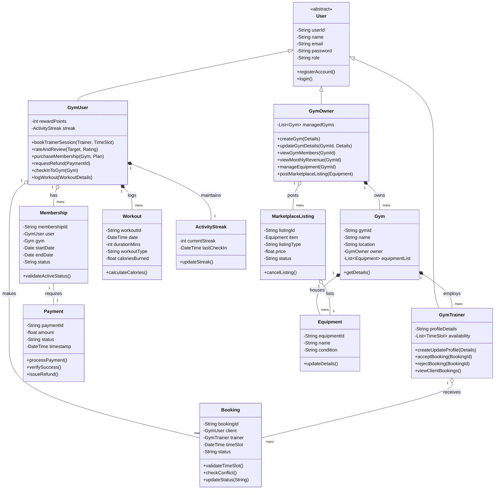
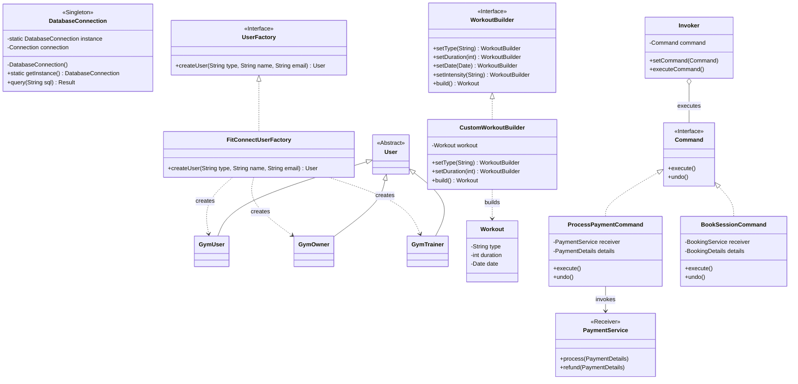

# FitConnect Architecture Diagrams

Here are the complete class diagrams derived from your use case diagram, along with the specific design pattern implementations requested.

## 1. Complete System Class Diagram
This diagram represents the core domain model, capturing all actors, entities, and their relationships based on the functionalities outlined in the use case diagram (Booking, Memberships, Fitness Tracking, Marketplace, etc.).

## 2. Design Patterns Implementation Diagram
This diagram highlights how specific software design patterns (Factory, Builder, Singleton, Command) are integrated into the FitConnect architecture to ensure modularity, scalability, and robust object creation/execution.

