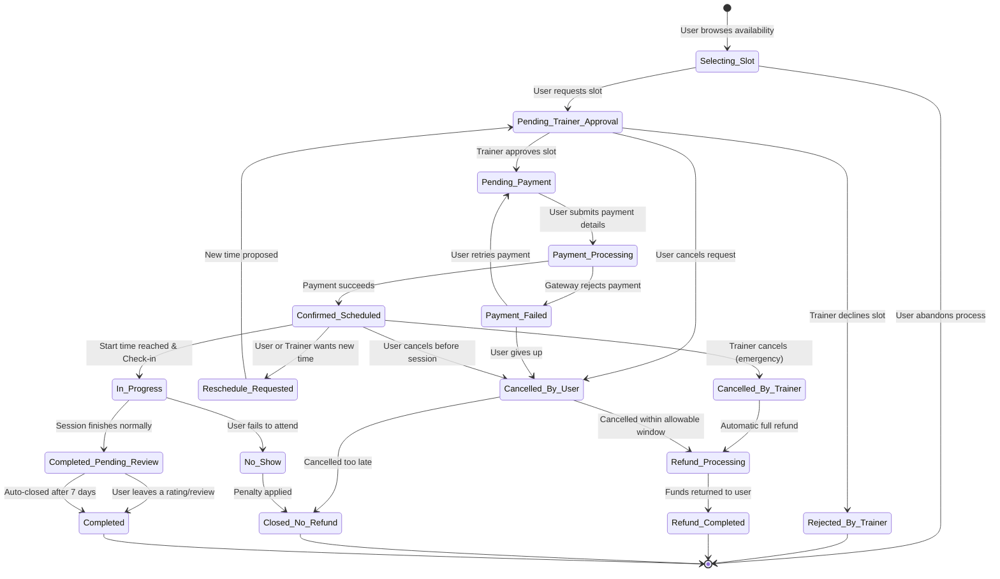

# FitConnect State Diagram: Trainer Booking Lifecycle

This is an extensive state diagram that maps out the complete, end-to-end lifecycle of a **Trainer Booking Session**. It covers the longest chain of possible states an entity can go through in your system—from initial slot selection, through approvals, payment handling, rescheduling loops, the actual session, cancellations, and post-session reviews/refunds.

