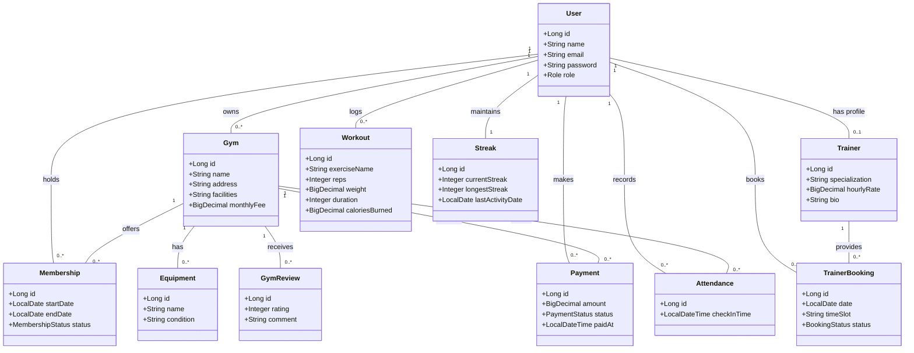

# FitConnect Class Diagrams

Here are the class diagrams requested, generated using Mermaid.

## 1. Clean Domain Model (Without Design Patterns)
This diagram maps out the core business entities and their relationships.



<hr/>

## 2. Design Pattern Implementations

This diagram illustrates how specific design patterns are implemented in the FitConnect platform.

```mermaid
classDiagram
    %% Factory Pattern
    namespace FactoryPattern {
        class PaymentProcessorFactory {
            +getProcessor(String type)$ PaymentProcessor
        }
        
        class PaymentProcessor {
            <<interface>>
            +process() void
        }
        
        class StripePaymentProcessor {
            +process() void
        }
        
        class PaypalPaymentProcessor {
            +process() void
        }
        
        class RazorpayPaymentProcessor {
            +process() void
        }
        
        class MockPaymentProcessor {
            +process() void
        }
        
        class PaymentService {
            +processPayment(PaymentRequest) PaymentResponse
        }
    }
    
    PaymentProcessorFactory ..> PaymentProcessor : creates
    PaymentProcessor <|.. StripePaymentProcessor : implements
    PaymentProcessor <|.. PaypalPaymentProcessor : implements
    PaymentProcessor <|.. RazorpayPaymentProcessor : implements
    PaymentProcessor <|.. MockPaymentProcessor : implements
    PaymentService --> PaymentProcessorFactory : uses
    
    %% Builder Pattern
    namespace BuilderPattern {
        class User {
            -Long id
            -String name
            -String email
            +builder()$ UserBuilder
        }
        
        class UserBuilder {
            -Long id
            -String name
            -String email
            +id(Long) UserBuilder
            +name(String) UserBuilder
            +email(String) UserBuilder
            +build() User
        }
    }
    
    User +-- UserBuilder : inner class
    UserBuilder ..> User : builds
    
    %% Command Pattern
    namespace CommandPattern {
        class BookingCommand {
            <<interface>>
            +execute() BookingResponse
        }
        
        class AcceptBookingCommand {
            -TrainerBooking booking
            -TrainerBookingRepository repo
            +execute() BookingResponse
        }
        
        class RejectBookingCommand {
            -TrainerBooking booking
            -TrainerBookingRepository repo
            +execute() BookingResponse
        }
        
        class BookingCommandInvoker {
            +executeCommand(BookingCommand) BookingResponse
        }
        
        class BookingService {
            +updateBookingStatus() BookingResponse
        }
    }
    
    BookingCommand <|.. AcceptBookingCommand : implements
    BookingCommand <|.. RejectBookingCommand : implements
    BookingCommandInvoker --> BookingCommand : executes
    BookingService --> BookingCommandInvoker : uses
    BookingService ..> AcceptBookingCommand : creates
    BookingService ..> RejectBookingCommand : creates

    %% Chain of Responsibility Pattern
    namespace ChainOfResponsibility {
        class FilterChain {
            <<interface>>
            +doFilter(ServletRequest, ServletResponse)
        }
        
        class OncePerRequestFilter {
            <<abstract>>
            +doFilterInternal()
        }
        
        class JwtAuthenticationFilter {
            -JwtService jwtService
            -CustomUserDetailsService userDetailsService
            +doFilterInternal(HttpServletRequest, HttpServletResponse, FilterChain)
        }
        
        class SecurityConfig {
            +securityFilterChain(HttpSecurity) SecurityFilterChain
        }
    }
    
    OncePerRequestFilter <|-- JwtAuthenticationFilter : extends
    JwtAuthenticationFilter --> FilterChain : passes to next
    SecurityConfig --> JwtAuthenticationFilter : registers
```
