# FitConnect Design Patterns Implementation Diagram

This class diagram specifically models the implementations for the four design patterns you requested: **Factory** (Payment), **Builder** (Users), **Command** (Booking Trainer), and **Chain of Responsibility** (Security & JWT Auth).

```mermaid
classDiagram
    %% ==========================================
    %% 1. Factory Pattern (Payment Processing)
    %% ==========================================
    class PaymentProcessor {
        <<Interface>>
        +process(PaymentRequest request) PaymentResponse
    }
    
    class CreditCardProcessor {
        +process(PaymentRequest request) PaymentResponse
    }
    
    class PaypalProcessor {
        +process(PaymentRequest request) PaymentResponse
    }
    
    class PaymentProcessorFactory {
        +getProcessor(String paymentType) PaymentProcessor
    }
    
    class PaymentService {
        -PaymentProcessorFactory factory
        +processPayment(PaymentRequest request)
    }

    PaymentProcessor <|.. CreditCardProcessor
    PaymentProcessor <|.. PaypalProcessor
    PaymentProcessorFactory ..> PaymentProcessor : creates
    PaymentService --> PaymentProcessorFactory : uses


    %% ==========================================
    %% 2. Builder Pattern (User Creation)
    %% ==========================================
    class User {
        -String name
        -String email
        -String password
        -String role
    }
    
    class UserBuilder {
        <<Interface>>
        +setName(String name) UserBuilder
        +setEmail(String email) UserBuilder
        +setPassword(String password) UserBuilder
        +setRole(String role) UserBuilder
        +build() User
    }
    
    class GymUserBuilder {
        -User user
        +setName(String name) UserBuilder
        +setEmail(String email) UserBuilder
        +setPassword(String password) UserBuilder
        +setRewardPoints(int points) GymUserBuilder
        +build() GymUser
    }

    class GymTrainerBuilder {
        -User user
        +setName(String name) UserBuilder
        +setEmail(String email) UserBuilder
        +setPassword(String password) UserBuilder
        +setSpecialization(String spec) GymTrainerBuilder
        +build() GymTrainer
    }

    UserBuilder <|.. GymUserBuilder
    UserBuilder <|.. GymTrainerBuilder
    GymUserBuilder ..> User : builds
    GymTrainerBuilder ..> User : builds


    %% ==========================================
    %% 3. Command Pattern (Booking a Trainer)
    %% ==========================================
    class Command {
        <<Interface>>
        +execute()
        +undo()
    }
    
    class BookTrainerCommand {
        -TrainerService receiver
        -BookingRequest request
        +execute()
        +undo()
    }
    
    class CancelBookingCommand {
        -TrainerService receiver
        -String bookingId
        +execute()
        +undo()
    }
    
    class TrainerService {
        <<Receiver>>
        +createBooking(BookingRequest request)
        +removeBooking(String bookingId)
    }
    
    class BookingInvoker {
        -Command command
        +setCommand(Command c)
        +invoke()
    }

    Command <|.. BookTrainerCommand
    Command <|.. CancelBookingCommand
    BookTrainerCommand --> TrainerService : receiver
    CancelBookingCommand --> TrainerService : receiver
    BookingInvoker o-- Command : executes


    %% ==========================================
    %% 4. Chain of Responsibility (Security & JWT)
    %% ==========================================
    class Filter {
        <<Interface>>
        +doFilter(Request req, Response res, FilterChain chain)
    }
    
    class FilterChain {
        <<Interface>>
        +doFilter(Request req, Response res)
    }
    
    class DefaultFilterChain {
        -List~Filter~ filters
        -int index
        +doFilter(Request req, Response res)
    }
    
    class JwtAuthenticationFilter {
        -JwtService jwtService
        +doFilter(Request req, Response res, FilterChain chain)
    }
    
    class RateLimitingFilter {
        +doFilter(Request req, Response res, FilterChain chain)
    }
    
    class CorsFilter {
        +doFilter(Request req, Response res, FilterChain chain)
    }
    
    class SecurityConfig {
        +configureFilters() FilterChain
    }

    Filter <|.. JwtAuthenticationFilter
    Filter <|.. RateLimitingFilter
    Filter <|.. CorsFilter
    FilterChain <|.. DefaultFilterChain
    DefaultFilterChain o-- Filter : contains
    JwtAuthenticationFilter --> FilterChain : passes control
    RateLimitingFilter --> FilterChain : passes control
    CorsFilter --> FilterChain : passes control
    SecurityConfig ..> DefaultFilterChain : builds chain


    %% ==========================================
    %% 5. Singleton Pattern (Application Config)
    %% ==========================================
    class AppConfig {
        <<Singleton>>
        -static volatile AppConfig instance
        -long refundWindowHours
        -int jwtExpiryDays
        -String appName
        -AppConfig()
        +static getInstance() AppConfig
        +getRefundWindowHours() long
        +getJwtExpiryDays() int
        +getAppName() String
    }
```

