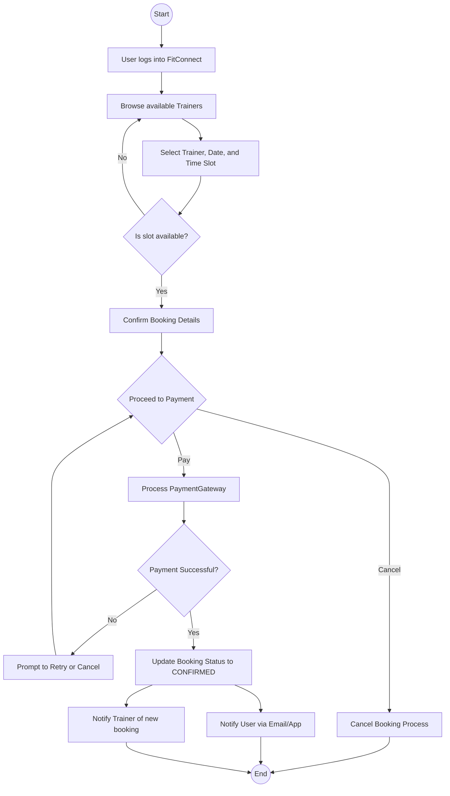
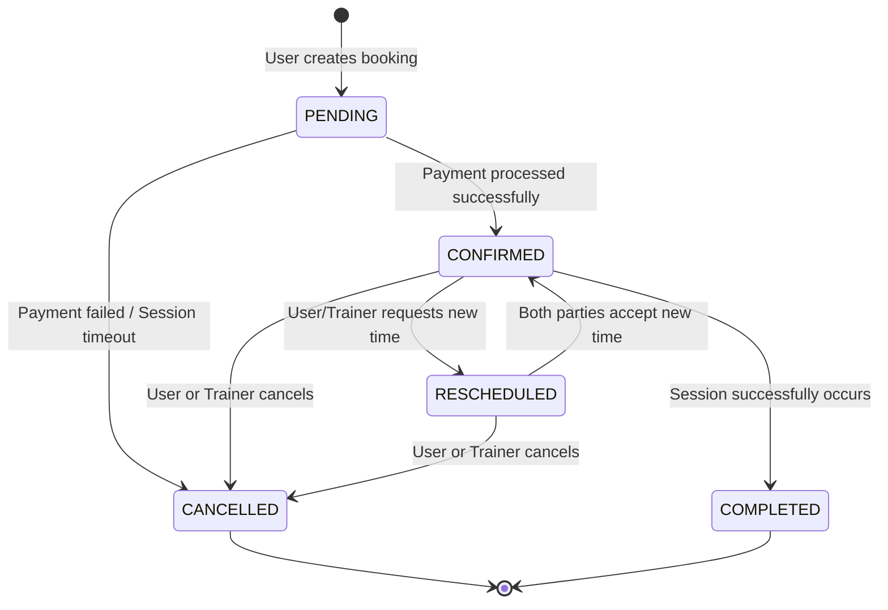
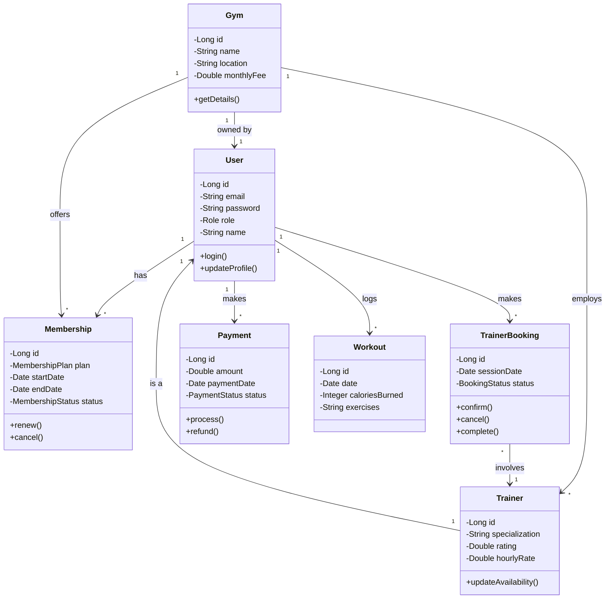
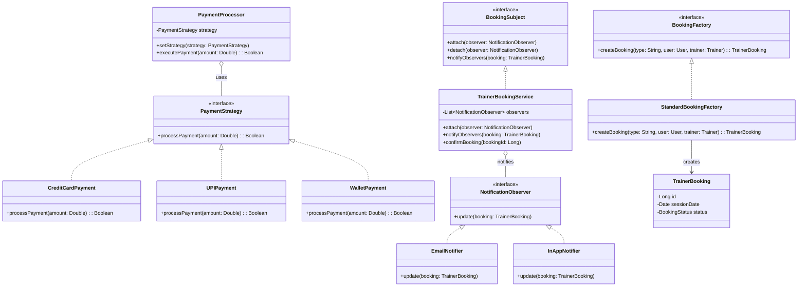

# FitConnect UML Diagrams

This document contains the Activity, State, and Class diagrams for the FitConnect application.

## 1. Activity Diagram: Trainer Booking Process

This activity diagram illustrates the process of a user booking a gym trainer.

## 2. State Diagram: Trainer Booking Lifecycle

This state diagram shows the different states a `TrainerBooking` object can be in throughout its lifecycle.

## 3. General Class Diagram (Without Design Patterns)

This is a general domain model class diagram for the core entities in FitConnect.

## 4. Class Diagram (Applying Design Patterns)

This class diagram illustrates how design patterns (Strategy, Observer, and Factory) can be applied to the FitConnect architecture to improve extensibility and maintainability.

